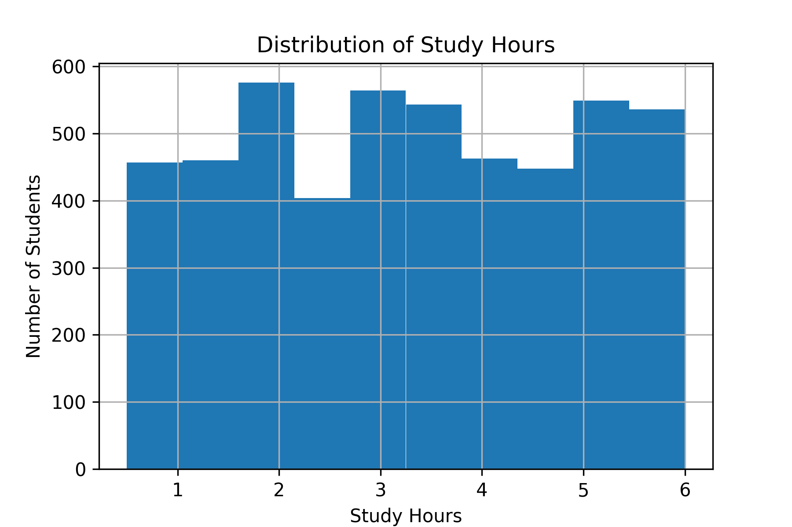
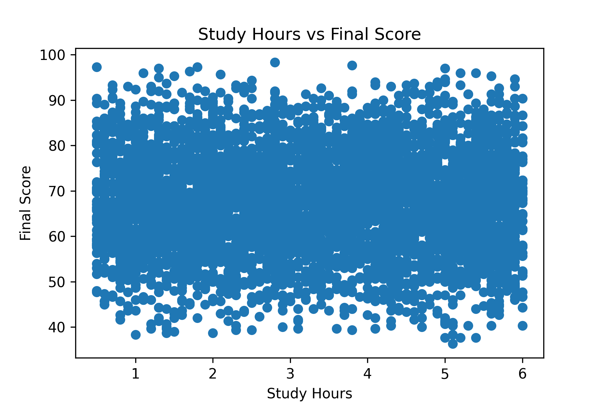

# 🎓 Student Performance Prediction

## 📌 Project Overview

This project predicts a student's final score based on factors such as study hours and attendance using Machine Learning.

It demonstrates the complete Machine Learning workflow, including:

- Data Cleaning
- Exploratory Data Analysis (EDA)
- Data Visualization
- Model Training
- Model Evaluation
- Prediction

---

## 🎯 Objective

To build a Linear Regression model that predicts student performance using academic data.

---

## 🛠️ Technologies Used

- Python
- Pandas
- NumPy
- Matplotlib
- Scikit-learn
- Google Colab

---

## 📂 Dataset

Student Performance Dataset

Features used:

- Study Hours
- Attendance

Target:

- Final Score

---

## 📊 Data Cleaning

The dataset was cleaned by:

- Removing missing values
- Removing duplicate rows
- Checking data types

---

## 📈 Data Visualization

The following visualizations were created:

- Histogram of Study Hours
- Scatter Plot of Study Hours vs Final Score
- Correlation Matrix

### Histogram

### Scatter Plot

---

## 🤖 Machine Learning Model

Algorithm Used:

**Linear Regression**

---

## 📏 Model Evaluation

Evaluation Metrics:

- Mean Absolute Error (MAE)
- R² Score

---

## 🚀 Future Improvements

- Add more student features
- Compare multiple ML algorithms
- Deploy using Streamlit
- Improve prediction accuracy

---

## 👩‍💻 Author

Created by **Tirunagari Deetya Abhirami**
