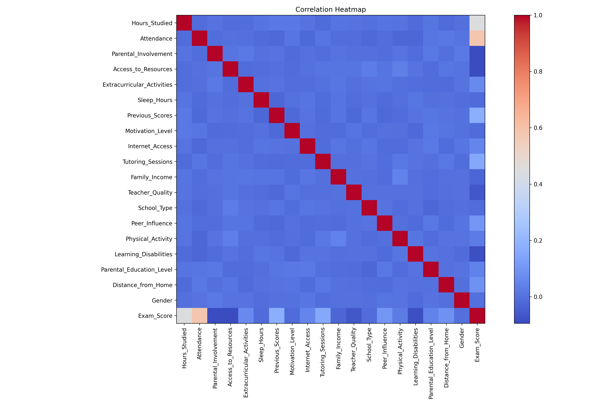
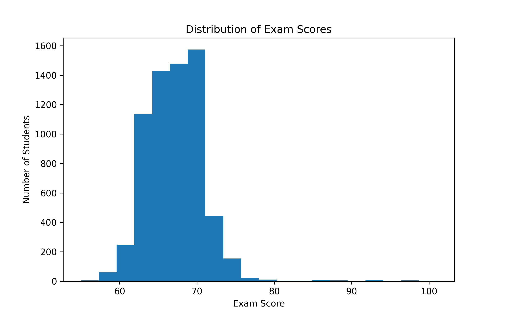
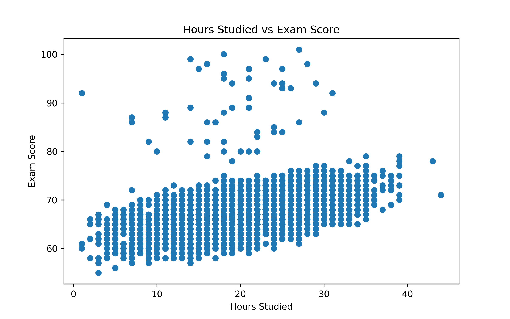
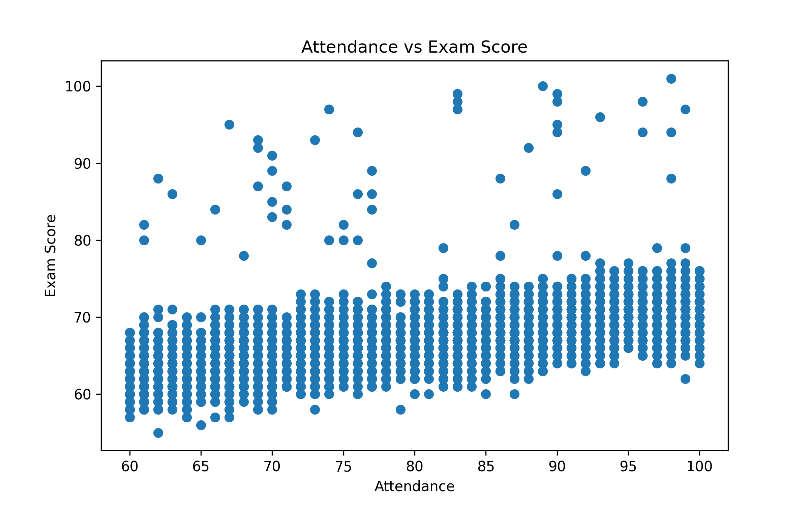
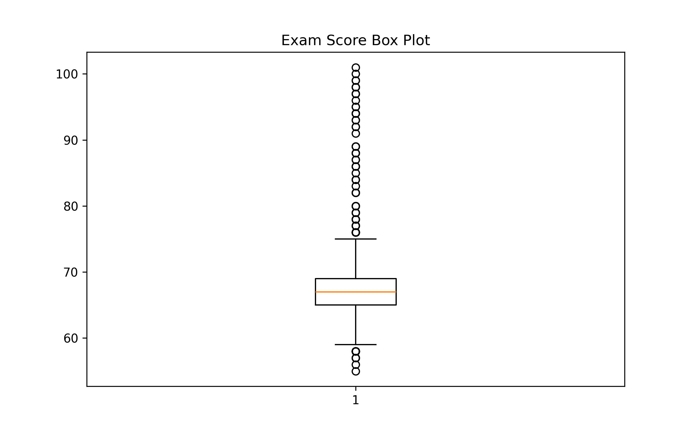
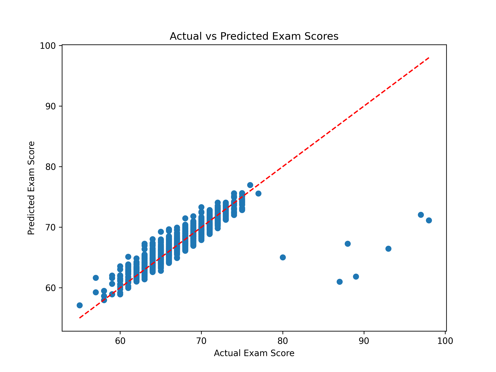
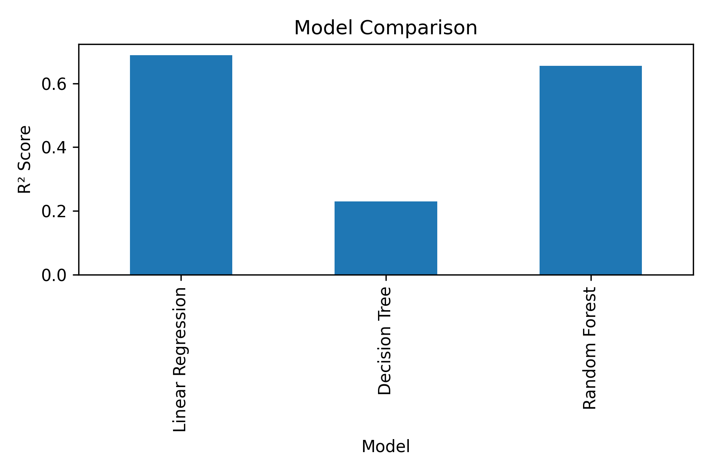

# 🎓 Student Performance Prediction using Machine Learning

## Project Overview

This project predicts students' exam scores using Machine Learning techniques based on academic, personal, and social factors.

The complete machine learning workflow includes:

- Data Cleaning
- Exploratory Data Analysis (EDA)
- Data Visualization
- Feature Engineering
- Model Training
- Model Comparison
- Model Evaluation
- Model Saving

---

## Dataset

- **Dataset Name:** Student Performance Factors Dataset
- **Source:** Kaggle
- **Total Records:** 6,607
- **Total Features:** 20

### Features include:

- Hours Studied
- Attendance
- Previous Scores
- Sleep Hours
- Motivation Level
- Teacher Quality
- Family Income
- Internet Access
- Physical Activity
- Tutoring Sessions
- School Type
- Peer Influence
- Gender
- Distance from Home
- Parental Education
- and more...

### Target Variable

- **Exam_Score**

---

# Technologies Used

- Python
- Pandas
- NumPy
- Matplotlib
- Scikit-learn
- Joblib
- Google Colab
- GitHub

---

# Data Preprocessing

The following preprocessing steps were performed:

- Loaded the dataset
- Checked dataset information
- Handled missing values
- Removed duplicate values
- Encoded categorical variables using Label Encoding
- Prepared features and target variable

---

# Exploratory Data Analysis

The project includes the following visualizations:

## Correlation Heatmap



---

## Exam Score Distribution



---

## Hours Studied vs Exam Score



---

## Attendance vs Exam Score



---

## Box Plot



---

## Actual vs Predicted Scores



---

## Model Comparison



---

# Machine Learning Models

Three regression algorithms were trained and evaluated:

1. Linear Regression
2. Decision Tree Regressor
3. Random Forest Regressor

---

# Model Performance

| Model | MAE | RMSE | R² Score |
|------|------:|------:|------:|
| **Linear Regression** | **1.02** | **2.10** | **0.6888** |
| Random Forest | 1.13 | 2.21 | 0.6546 |
| Decision Tree | 1.73 | 3.30 | 0.2305 |

---

# Best Model

**Linear Regression**

Performance:

- Mean Absolute Error (MAE): **1.02**
- Root Mean Squared Error (RMSE): **2.10**
- R² Score: **0.6888**

The Linear Regression model achieved the best overall performance on this dataset and was selected as the final model.

---

# Project Structure

```text
Student-Performance-Prediction
│
├── Student_Performance_Prediction.ipynb
├── StudentPerformanceFactors.csv
├── student_performance_model.pkl
├── README.md
├── requirements.txt
├── LICENSE
│
├── heatmap.png
├── exam_score_histogram.png
├── hours_vs_exam.png
├── attendance_vs_exam.png
├── boxplot.png
├── actual_vs_predicted.png
└── model_comparison.png
```

---

# How to Run

### Clone the repository

```bash
git clone https://github.com/Deetya22/Student-Performance-Prediction.git
```

### Install dependencies

```bash
pip install -r requirements.txt
```

### Open the notebook

```text
Student_Performance_Prediction.ipynb
```

Run all cells to reproduce the results.

---

# Future Improvements

- Hyperparameter tuning
- Cross-validation
- XGBoost Regressor
- LightGBM Regressor
- Feature importance analysis
- Streamlit web application
- Model deployment

---

# Author

**Tirunagari Deetya Abhirami**

B.Sc. Data Science Student

---

# ⭐ If you found this project useful

Please consider giving it a ⭐ on GitHub!
